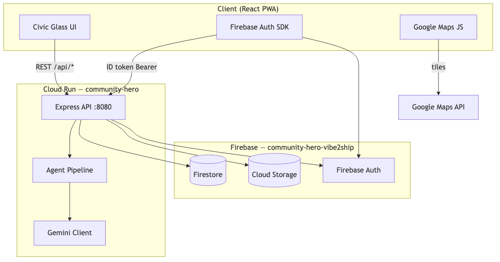
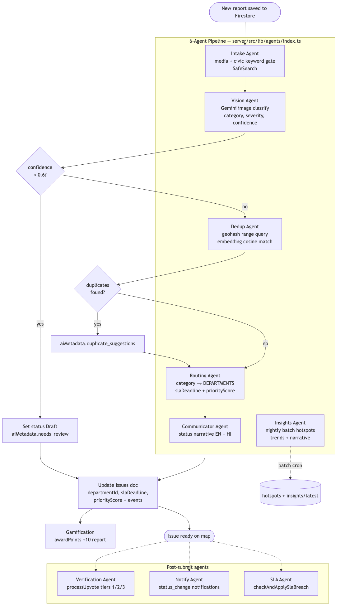

# Community Hero (CIVICPULSE AI)

Hyperlocal civic issue reporting for Indian urban citizens — potholes, water leaks, streetlights, and waste. Built for **Vibe to Ship (Vibe2Ship)** — Problem Statement 2: Community Hero.

## Live URLs

| Item | URL |
|------|-----|
| **Deployed app (Cloud Run)** | https://community-hero-987477089222.asia-south1.run.app |
| **API health** | https://community-hero-987477089222.asia-south1.run.app/api/health |
| **Embed map widget** | https://community-hero-987477089222.asia-south1.run.app/embed/map |
| **Google AI Studio** | https://aistudio.google.com/apps — Build → export → Cloud Run (keep app live through judging) |
| Vercel preview | https://community-hero-eight.vercel.app |
| GitHub | https://github.com/Ojas-Srivastava05/community-hero |
| Submission tag | `v1.0.0-submission` — `bash scripts/prepare-submission.sh` |

**Embed snippet (RWAs / news):**

```html
<iframe
  src="https://community-hero-987477089222.asia-south1.run.app/embed/map?lat=12.9716&lng=77.5946"
  width="390"
  height="560"
  style="border:0;border-radius:16px"
  title="Community Hero live map"
></iframe>
```

## Official 8 features (Vibe2Ship)

| # | Feature | Route / API | Phase |
|---|---------|-------------|-------|
| 1 | Image & video reporting | `/report` — 3-step wizard, WebP resize | 2 |
| 2 | AI issue categorization | POST `/api/reports/analyze` — Gemini Vision | 2, 6 |
| 3 | Geo-location & mapping | `/map` — Google Maps + list fallback | 3 |
| 4 | Community verification | POST `/api/reports/:id/upvote` — tiers 1/3/10 | 5 |
| 5 | Real-time issue tracking | `/issues/:id` timeline, `/my-reports` SLA | 4, 7 |
| 6 | Impact dashboards | `/dashboard`, `/api/analytics/*` | 8 |
| 7 | Predictive insights | `/api/analytics/hotspots`, AI insight card | 9 |
| 8 | Gamification | `/leaderboard`, civic points & badges | 10 |

**Also shipped:** 6-agent pipeline · Admin panel · Civic assistant · Open311 export · Activity threads

## Architecture

Production is a **single Cloud Run container** (`asia-south1`): Express serves `/api/*` and the Vite-built SPA.





| Diagram | Source | Description |
|---------|--------|-------------|
| System architecture | [`docs/diagrams/mermaid/01-system-architecture.mmd`](docs/diagrams/mermaid/01-system-architecture.mmd) | PWA → Cloud Run → Firebase + Gemini |
| Agent workflow | [`docs/diagrams/mermaid/04-agent-workflow.mmd`](docs/diagrams/mermaid/04-agent-workflow.mmd) | 6 agents, confidence gate, dedup branch |
| Report intake sequence | [`docs/diagrams/mermaid/05-report-intake-sequence.mmd`](docs/diagrams/mermaid/05-report-intake-sequence.mmd) | Photo → analyze → submit latency |
| Firestore schema | [`docs/diagrams/mermaid/08-firestore-schema.mmd`](docs/diagrams/mermaid/08-firestore-schema.mmd) | Collections, subcollections |
| Deployment topology | [`docs/diagrams/mermaid/12-deployment-topology.mmd`](docs/diagrams/mermaid/12-deployment-topology.mmd) | Cloud Run, CI/CD, Google APIs |

Render PNGs: `npx @mermaid-js/mermaid-cli -i docs/diagrams/mermaid/ -o docs/diagrams/png/`

Full write-up: [`docs/architecture.md`](docs/architecture.md) · API: [`docs/api_contract.md`](docs/api_contract.md)

## Google stack

| Layer | Technology |
|-------|------------|
| Frontend | React 19 + Vite PWA (mobile-first civic UI) |
| Backend | Node.js + Express (API + static serve) |
| Auth | Firebase Authentication (Google Sign-In) |
| Database | Cloud Firestore |
| Storage | Firebase Storage |
| AI | Gemini 2.5 Flash |
| Maps | Google Maps Platform |
| Deploy | Cloud Run (`asia-south1`) + Vercel preview |

## Team

**Solo project:** **Ojas Srivastava** — full-stack, AI/agents, frontend, data/geo, deploy, docs, and submission.

Details: [`docs/TEAM-ROLES.md`](docs/TEAM-ROLES.md)

## Submission (Phases 18–19)

| Document | Purpose |
|----------|---------|
| [`docs/submission/GOOGLE-DOC-CONTENT.md`](docs/submission/GOOGLE-DOC-CONTENT.md) | Appendix J — paste into Google Docs |
| [`docs/ppt-info/SLIDES-COMPLETE.md`](docs/ppt-info/SLIDES-COMPLETE.md) | 15 slides with full speaker notes |
| [`docs/SUBMISSION-CHECKLIST.md`](docs/SUBMISSION-CHECKLIST.md) | BlockseBlock checklist with evidence |
| [`docs/demo/APPENDIX-I-DEMO-SCRIPT.md`](docs/demo/APPENDIX-I-DEMO-SCRIPT.md) | 3-minute judge demo |
| [`docs/PHASE-COMPLETION-TRACKER.md`](docs/PHASE-COMPLETION-TRACKER.md) | Phases 0–19 at 100% |

Prepare submission: `bash scripts/prepare-submission.sh`  
Verify production: `bash scripts/verify-phases.sh`

**Deadline:** June 29, 2026, 2:00 PM — BlockseBlock

## Local development

```bash
cp .env.example frontend/.env    # Firebase keys
cd server && cp ../.env.example .env && npm install && npm run dev   # :3001
cd frontend && npm install && npm run dev   # :5173 (proxies /api)
```

Seed demo data: `cd server && npx tsx scripts/seed-firestore.ts`  
Deploy Cloud Run: `bash scripts/deploy-cloud-run.sh` or `make deploy`

## Firebase project

Dedicated project: `community-hero-vibe2ship` (isolated from LogiFlow).

Add Cloud Run hostname to **Firebase Auth → Authorized domains** for Google Sign-In on production.

## Design

**Look:** Warm paper + coral civic UI (Space Grotesk / Fraunces). Mobile-first PWA. See [`.stitch/DESIGN.md`](.stitch/DESIGN.md) for earlier Stitch explorations.

## License

MIT — Vibe to Ship submission
